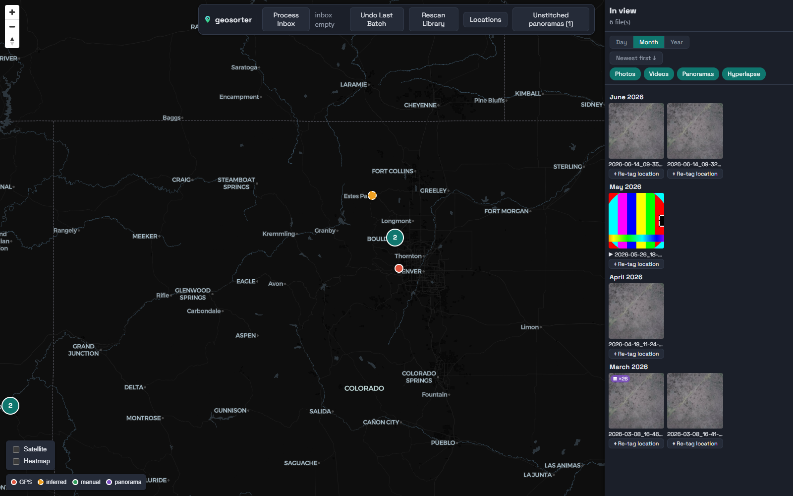
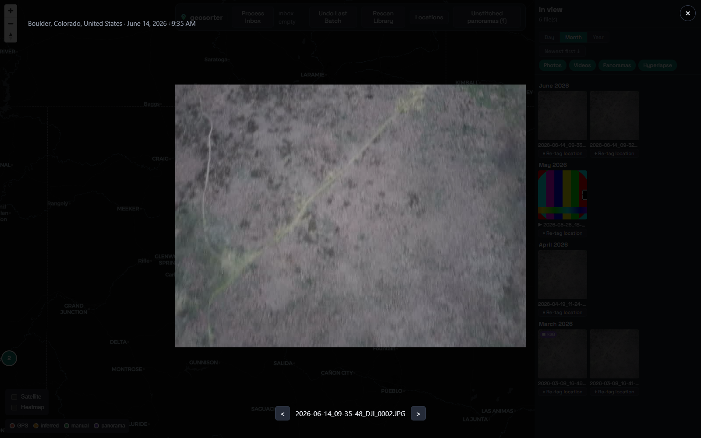
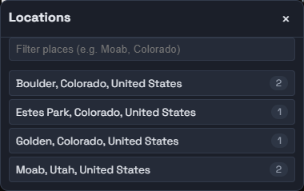

# geosorter

geosorter is a local-first DJI media organizer and browser. It extracts capture
metadata, resolves each capture to a place and local date, moves related files as a
unit, and presents the resulting library on an interactive map.

It supports photos, videos, hyperlapses, DJI panorama sets, SRT flight tracks,
no-GPS recovery, HEVC playback proxies, and optional Hugin panorama stitching.



_Screenshots use a small synthetic library; the interface is the real application._

The media viewer keeps the capture's place and local time visible while providing
previous/next navigation through the currently displayed files.



The Locations panel provides a quick way to search the library and move the map to a
place.



## Requirements

- Python 3.13 or newer
- [uv](https://docs.astral.sh/uv/) for the recommended Python workflow
- Node.js and npm to build or develop the web interface
- ExifTool 12.24 or newer for DJI photo and video metadata
- FFmpeg and ffprobe for video inspection, posters, previews, and HEVC proxies
- Optional: Hugin CLI tools for stitched panorama heroes

ExifTool, `ffmpeg`, and `ffprobe` must be available on `PATH`. Hugin can be on
`PATH` or configured with `hugin_bin_dir`.

The map uses hosted OpenFreeMap tiles. Organizing and browsing cached media are local,
but displaying the basemap requires an internet connection.

## Install

From a clone of this repository:

```bash
uv sync
npm --prefix frontend ci
npm --prefix frontend run build
```

The frontend build is written to `src/geosorter/webui`, where the Python server can
serve it on the same origin as the API.

## Configure

Create a starter configuration:

```bash
uv run geosorter init-config
```

The command prints the path it created. Edit at least these two values:

```toml
inbox_path = 'D:\Drone\Inbox'
library_root = 'Z:\DroneLibrary'
```

- `inbox_path` is the folder to scan for new card dumps or uploads.
- `library_root` is the organized destination and may be a local disk, mapped drive,
  or NAS path.
- The index, GeoNames database, and thumbnail cache default to local user-data/cache
  directories rather than the media library.

See [`geosorter.example.toml`](geosorter.example.toml) for cache tiers, duplicate
handling, GPS inference, panorama settings, HEVC proxy warming, and other optional
settings.

Configuration is resolved in this order:

1. `--config PATH`
2. `GEOSORTER_CONFIG`
3. the platform-specific user configuration directory

For a repository-local config, create `geosorter.toml` and pass it explicitly:

```bash
uv run geosorter organize --config geosorter.toml --dry-run
```

The local `geosorter.toml` is ignored by Git because it normally contains personal
paths.

## Bootstrap place data

Before the first import, download and index the GeoNames city/admin data:

```bash
uv run geosorter bootstrap
```

To also prefer nearby named parks, peaks, and hydro features over a distant town:

```bash
uv run geosorter bootstrap --features
```

`--features` downloads the much larger GeoNames `allCountries` dataset. Bootstrap is
normally a one-time operation.

## Organize media

Start with the read-only diagnostics and dry run:

```bash
uv run geosorter diagnose-inbox
uv run geosorter organize --dry-run
```

When the proposed destinations look correct, run the import:

```bash
uv run geosorter organize
```

The first destructive run asks for confirmation. Captures are filed under:

```text
<library_root>/<Place>/<YYYY-MM-DD>/<YYYY-MM-DD>_<HH-MM-SS>_<DJI filename>
```

geosorter groups primary media with companions such as DNG, LRF, SRT, panorama
frames, and retained hyperlapse frames. Cross-volume moves copy and verify the bytes
before deleting the source, and each move is recorded so interrupted runs can be
resumed safely.

Captures without a usable GPS location are quarantined instead of guessed. A nearby
capture can supply an inferred location when it falls within
`inference_max_gap_minutes`; otherwise the capture remains available in the
interface's No-GPS workflow.

## Run the interface

Start the local server:

```bash
uv run geosorter serve
```

Then open [http://127.0.0.1:8000](http://127.0.0.1:8000).

The main interface provides:

- Clustered map markers for GPS, inferred, manually assigned, and panorama captures
- Satellite and heatmap display modes
- A viewport-aware file rail grouped by day, month, or year
- Newest/oldest sorting and photo, video, panorama, and hyperlapse filters
- Photo viewing, video playback, panorama source-frame galleries, and flight tracks
- A searchable Locations panel that flies the map to a selected place
- Selective inbox imports, undo, rescan, no-GPS assignment, re-tagging, and panorama
  stitching for administrators

Click a map cluster to zoom in, a marker or thumbnail to open the viewer, or
**Locations** to jump directly to a named place. **Re-tag location** moves an
organized capture and its companions after you choose a new point on the map.

The **Process Inbox** panel scans the configured inbox and lets you import every
capture or only selected capture groups. Progress is shown in the toolbar, and the
library refreshes when the job finishes.

## Admin password and network access

The app is fully open when no admin password is configured. To make management
actions require a login:

```bash
uv run geosorter set-admin-password
```

With a password set, unauthenticated users can browse the library but cannot organize,
undo, rescan, assign locations, re-tag files, or start stitches.

The server binds to loopback by default. Binding another address exposes the library's
media and GPS coordinates to that network:

```bash
uv run geosorter serve --host 0.0.0.0 --port 8000
```

The admin password protects management actions, not read access to the map and media.
Only use a non-loopback bind on a trusted network or behind an appropriate VPN/reverse
proxy.

## Useful maintenance commands

| Command | Purpose |
| --- | --- |
| `geosorter diagnose-inbox` | Explain why each inbox file would organize, quarantine, or remain in place without changing anything |
| `geosorter undo` | Move the most recent organized batch back to the inbox |
| `geosorter undo --batch ID` | Undo a specific batch |
| `geosorter rescan --dry-run` | Preview stale index rows for files no longer present in the library |
| `geosorter rescan` | Remove those stale rows from the index; never deletes or moves media |
| `geosorter verify-library` | Recompute stored hashes to detect missing or changed library files |
| `geosorter warm-proxies --all` | Pre-generate thumbnails, posters, and H.264 proxies for existing HEVC media |
| `geosorter clear-derived-cache` | Clear local thumbnails/posters/previews so they regenerate; keeps expensive proxies and stitches |
| `geosorter recover-collisions --dry-run` | Preview recovery for libraries affected by the historical recycled-filename collision |
| `geosorter restitch --dry-run` | Preview panorama heroes that need projection-aware re-stitching |

When using a non-default configuration, add `--config PATH` to the chosen command:

```bash
uv run geosorter verify-library --config geosorter.toml
```

## Development

Run the backend and Vite development server in separate terminals:

```bash
uv run geosorter serve
```

```bash
npm --prefix frontend run dev
```

Vite proxies `/api` requests to the backend at `127.0.0.1:8000`.

Run the checks with:

```bash
uv run pytest
npm --prefix frontend run test
npm --prefix frontend run lint
npm --prefix frontend run build
```

The Python package lives in `src/geosorter`, the React/TypeScript application lives in
`frontend`, and the higher-level architecture notes are indexed in [`wiki/index.md`](wiki/index.md).

## License

MIT. See [`LICENSE`](LICENSE).
